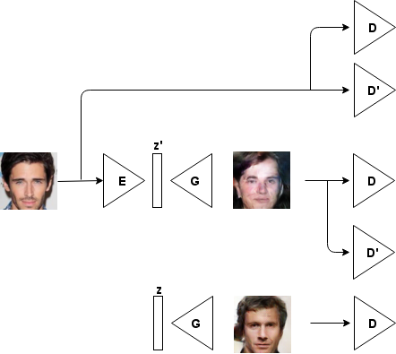

# ABC-GAN -- loose encoder EXPERIMENTAL BRANCH

***Note:*** *This is an experimental branch and might not work properly. In case there is an error please don't hesitate to make a pull request :)*

## Usage

There is a flag to enable the loose encoder: `--loose_encoder`

E.g.

* `python main.py --dataset celebA --folder_suffix=_abcgan_celebA_controller_loose_encoder_blur_3x3_256 --input_height=128 --output_height=256 --GpD_ratio=-1 --blur_strategy=3x3 --epoch=30 --batch-size=64 --train --with_loose_encoder --crop True`

## Architecture

Here is a quick overview of the resulting architecture

***Note:*** *The auto-encoder consisting of the encoder E and generator G has no L2 loss during training. The encoder only gets trained by training G and the resulting back propagation of the error.*

## How does it work?

The encoder acts like a hashing machine. If we look at the distribution of the encoded z-space we notice that E saturates and encodes all images from the dataset into the corners of the z-space (in our case -1 and 1).

During training we therefore force the GAN to care also about those vectors. In contrast to the usual sampling of z vectors we have here a quite restricted amount of vectors. In simpler terms: We want the generator to create images from everywhere in the z-space but he has to care especially well on some specific vectors. 

***Note:*** *It's very likely that we can simplify and optimize this architecture. Because of timing constraints we ended up with this presented architecture.*

## Sample results

Usually we sampled after around 20 epochs. The last experiment with the higher resolution has been sampled after 30 epochs and took around 2 days on a GTX Titan (Pascal).

**Image showing a sample obtained using the loose encoder network in combination with the controller**

**Image resulting of some variations on the default DCGAN implementation we used. We changed the activation functions from leaky relu to relu and the batch norm momentum to 0.999**

**We also conducted some tests on space continuity using random walks in z-space**

**Image obtained from ABC-GAN with the loose encoder and a fixed blur of size 3x3 and an output resolution of 128 by 128 pixels**

**Same experiment as before now using an output resolution of 256 by 256 pixels**

## Acknowledgement

* Thanks, Prof. Luc Van Gool for the semester thesis at the Computer Vision Lab D-ITET at ETH Zurich
* Thanks for supervising this thesis Eirikur Agustsson and Radu Timofte
* This work has been based on the [DCGAN implementation found on GitHub](https://github.com/carpedm20/DCGAN-tensorflow)

## Author

Igor Susmelj / [@igorsusmelj](https://github.com/IgorSusmelj)
