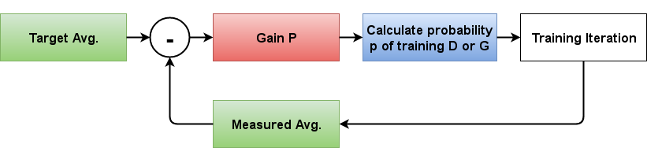
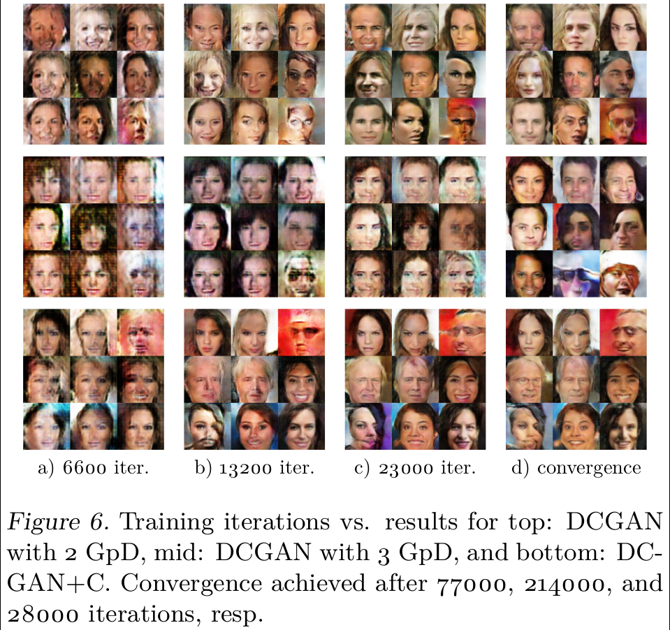

# ABC-GAN

The work represented in this repository is the result of a 14 week semesterthesis on photo-realistic image generation using generative adversarial networks at ETH zurich. 

## Additional Experiments

There is a second branch called `loose_encoder` in which you will find another experiment conducted during the thesis. Unfortunately we didn't had enough time to make an in-depth analysis of the results. The `loose encoder` can be added to any other experiment with a simple flag and in specific datasets such as CelebA results in astonishing improvement of generated image quality. To the best of our knowledge there is no GAN out there resulting in similar realistic images on celebA with a 64 by 64 output resolution. (Check the other branch for some samples)

## Prerequisites

The code has been built and tested using the following packages (and versions)

* Pillow (4.0.0)
* scikit-learn (0.18.1)
* scipy (0.18.1)
* numpy (1.12.1)
* tensorflow-gpu (1.1.0rc1)


## Usage

Make sure you have a running tensorflow setup.

We added some special flags to have a better overview of the different experiments. One thing we added is a `folder_suffix` which will be appended to all checkpoint, log and samples folders. 

Here are some examples to train the ABC-GAN with datasets:

* `python main.py --dataset celebA --folder_suffix=_abcgan_1_GpD_o64 --input_height=128 --output_height=64 --GpD_ratio=1 --blur_strategy=3x3 --epoch=8 --train --crop True`
* `python main.py --dataset lsun --folder_suffix=_abcgan_lsun_controller_blur_3x3_o128 --input_fname_pattern=*.webp --input_height=256 --output_height=128 --GpD_ratio=-1 --blur_strategy=3x3 --epoch=20 --batch-size=64 --train --crop True`
* `python main.py --dataset cifar10 --folder_suffix=_abcgan_cifar_3GpD_regressive_hyperbolic_o32 --input_height=32 --input_fname_pattern=*.png --output_height=32 --blur_strategy=reg_hyp --epoch=100 --train --crop True`

### Datasets

The following datasets have been used:

* [CelebA](http://mmlab.ie.cuhk.edu.hk/projects/CelebA.html) (> 200'000 celebrity faces, 178 px lower side)
* [Cifar10](https://www.cs.toronto.edu/~kriz/cifar.html) (60'000 pictures of 10 categories, 32x32 px)
* [LSUN](http://www.yf.io/p/lsun) (> 3 Mio images of bedrooms 256 px lower side)
* [ImageNet subset](http://image-net.org/small/download.php) (ImageNet subset, 64 by 64 pixels)

The easiest way to include the datasets is by having all images in one folder.
Using such a dataset can be done by just changing the `input_fname_pattern` to the correct file ending and specifying the folder name with `dataset`.
*(The folder with the dataset has to be in the subfolder data)*

**Folder structure used for our experiments:**

* **ABC-GAN**
  * **data**
    * **celebA**
    * **cifar10**
    * **lsun**
    * **train_64x64**
  * download.py
  * LICENSE
  * main.py
  * model.py
  * ops.py
  * utils.py
  * README.md
  * **report**

*train_64x64 is referring to the ImageNet subset. We used the same one as used in [Improved Wasserstein GAN](https://github.com/igul222/improved_wgan_training)*


#### Special Case LSUN

Since the LSUN dataset comes in a hierarchical structure with many files it makes sense to just use a reference file with the respective paths to the files.
The best way to do that is:

1. Inside the `abc-gan/data` folder create a subfolder lsun
2. Extract the downloaded lsun dataset here (we used `bedroom_train_lmdb.zip`)
3. Make a list of all files appearing in the extracted `lsun_train` folder
4. Name this file `lsun_images`

The `lsun_images` file should have a structure such as:

```
lsun_train/f/f/f/f/f/b/fffffbb9225d069b7f47e464bdd75e6eff82b61c.webp
lsun_train/f/f/f/f/f/6/fffff6cd254f0ead6191f3003519f6805e1e6619.webp
lsun_train/f/f/f/f/f/5/fffff548f9109fc3be2d71088f8e202ea78ac620.webp
lsun_train/f/f/f/f/f/a/fffffa900959150cb53ac851b355ec4adbc22e4e.webp
lsun_train/f/f/f/f/8/0/ffff80a1dc7e7d790ccd46f2fdd4dcfca929d2c3.webp
...
```

In order to use LSUN just again change the `input_fname_pattern` and switch the `dataset` to `lsun`. We hard coded the special case of lsun such that we will use the reference file to get the paths to the images.


# Results

## Adaptive Controller

One of the most important points during training of GANs is balancing the discriminator against the generator. If one of the two dominates the other a mode collapse can occur. Many people started playing around with the ratio between discriminator and generator. And others used thresholds to determine if one has to train the discriminator or the generator. 

In our work, we implemented a simple controller to get rid of this manual tuning. We end up controlling the probability of an image being real from the discriminator's point of view. Without a controller, this probability ends up being somewhere close to 0.5 since the discriminator has (once the network starts converging) a 50% chance of telling correctly if the samples he sees are coming from the real dataset or the generator. 

The controller gives you the following benefits:

* Reduced training time (up to a factor of 5)
* Reuse the same network for different datasets (The controller automatically adapts to other datasets so you don't have to tune the ratio between D and G anymore)
* In some cases, the controller also improves stability during training

### Controller

**Controller architecture**:

*Note: The controller input is calculated using the two losses of the discriminator (loss for real and for fake images).*



The controller tries to keep the avg. value always at a reference point. The output of the controller is a probability of training either the discriminator or the generator.

### Controllability

**Plots showing average probability of a batch being classified as coming from the real dataset**

*From the discriminators point of view*


The left image shows the probability of being a real image using the controller. Right, the same experiment without the controller.

What we essentially do using the controller is, we control how many samples coming from the generator should be classified by the discriminator as real. By chance, this value stays at around 0.5 since after convergence the discriminator has a 50% chance of correctly classifying an image as real or fake. The controller reduces this value *(in our case from 0.5 to around 0.25)* which makes sure that the discriminator always has a good chance to correctly classify the source of an image. Therefore, the discriminator always slightly dominates the generator. 

### Training behaviour

**Training curve showing discriminator vs generator training iterations**

*Note: Without a controller and a fixed ratio between discriminator and generator updates we would see two straight lines*


Through the controller, the training of the networks adapts itself. In the beginning, the generator is getting trained more often but after around 5k steps the discriminator takes over. As known from GAN theory we actually want the discriminator to dominate the generator. And without a controller, this is very hard to achieve without changing the loss function (Wasserstein Loss, Cramer loss etc.)


**Convergence speed comparison of DCGAN with different GpD ratios and our controller**

*Note: One iteration is either training once the discriminator or the generator*


Comparison of convergence speed. GpD: Generator per Discriminator training iterations. (e.g. 3 GpD means we train the generator 3 times per discriminator)


## Adaptive Blur

GANs still have trouble with stability, image quality and output resolution. We implemented an adaptive blur filter to assist the discriminator and therefore improve overall results. We figured out that the discriminator has issues with details in images. To overcome this issue we just blur all images before they reach the discriminator. So in the end, the discriminator either sees blurred images from the generator or blurred images of the dataset. Using a fixed blur such as a 3 by 3 Gaussian kernel as we used in our experiments, has the side effect of additional noise in the output image. Since the generator has not to care about the details (since his output will be blurred anyway) he can add noise. To mitigate this effect, we added an adaptive blur which changes over training time. In the beginning, we have a strong blur such that the GAN can focus on improving the base structure of the output. In the end of the training, we have almost no blur, such that the GAN can now focus on the details. 

The blur gives you the following benefits:

* Improved stability during training. (We encountered several times the case that without blur the network was not able to converge at all)
* Improved image quality. (Despite the noise the output images look much more realistic)
* You can increase the resolution (We were able to use DCGAN for generating images at 256 by 256 pixels using CelebA or LSUN)

### DCGAN vs DCGAN with Blur (DCGAN+B)

**Image showing plain DCGAN without and with blur (DCGAN+B)**


The resulting images look much better with blur than without. They have more details but also noise.

**Comparison of different blurring strategies**

*We compare two regressive blur kernel (e.g. make sigma of a Gaussian blur smaller during training)*


The hyperbolic decreasing Gaussian blur is best when it comes to reducing the noise in the images. 

## ABC-GAN

Combination of the Adaptive Blur and Controller GAN.

We conducted different experiments using various datasets such as LSUN, CIFAR10 and CelebA. Some of the resulting images have been downscaled by a factor of two in order to reduce noise. *(Since on some screens and also printed the noise looks very annoying.)*

***Note:*** *In some samples, you will see a green bar at the top. The bar is indicating the probability of the image coming from the real dataset rather than from the generator. We used the discriminator losses and a softmax to evaluate this probability and use it as an input for the controller.*

### LSUN bedrooms dataset

**ABC-GAN with a fixed Gaussian Blur kernel of 3x3 and output resolution of 256 by 256 pixels**

*Randomly sampled batch. Downscaled to 128 by 128 pixels to reduce noise.*


We seem to reach the limit of DCGAN with this experiment. The same experiment without Blur failed. The images look not very realistic but one still sees that some of them look close to bedrooms.

### CIFAR10

**Comparison of results gathered using CIFAR10**


**Comparison of our best results with other works**


## Publications

* [ICML2017 Workshop on Implicit Generative Models](https://drive.google.com/open?id=0B3wEP_lEl0laVTdGcHE2VnRiMlE)

## Acknowledgement

* Thanks, Prof. Luc Van Gool for the semester thesis at the Computer Vision Lab D-ITET at ETH Zurich
* Thanks for supervising this thesis Eirikur Agustsson and Radu Timofte
* This work has been based on the [DCGAN implementation found on GitHub](https://github.com/carpedm20/DCGAN-tensorflow)

## Author

Igor Susmelj / [@igorsusmelj](https://github.com/IgorSusmelj)
